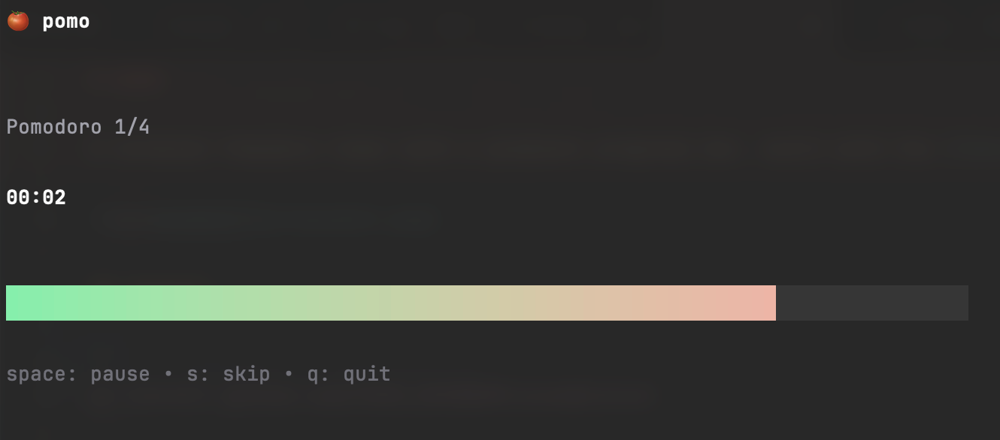

# pomo

A terminal Pomodoro timer with a gradient progress bar, built with the [Charm](https://charm.sh) stack.



## Install

```
go install github.com/lornest/pomo@latest
```

## Usage

```
pomo [flags]
```

### Flags

| Flag | Default | Description |
|------|---------|-------------|
| `-work` | `25m` | Work session duration |
| `-short` | `5m` | Short break duration |
| `-long` | `15m` | Long break duration |
| `-intervals` | `4` | Work sessions before a long break |
| `-no-sound` | `false` | Disable sound |
| `-no-notify` | `false` | Disable desktop notifications |

### Examples

```
pomo                          # defaults: 25m work, 5m short break
pomo -work 50m -short 10m    # longer sessions
pomo -work 10s -short 5s     # quick demo
```

### Controls

| Key | Action |
|-----|--------|
| `space` | Pause / resume |
| `s` | Skip to next session |
| `q` | Quit |

## How it works

Pomo cycles through work and break sessions automatically:

```
Work → Short Break → Work → Short Break → ... → Work → Long Break → repeat
```

A long break triggers after completing the configured number of work intervals (default 4). Desktop notifications and a sound play on macOS when each session ends.
